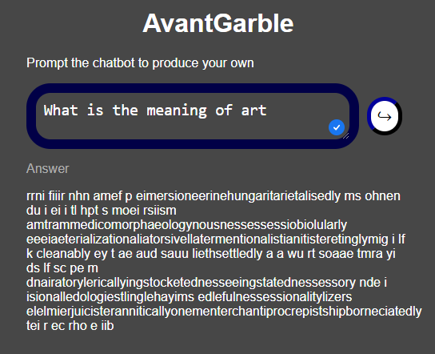

# AvantGarble - Dadaist chatbot

In the early 20th century a group of Italian and Swiss artist revolted by the
horrors of WWI started making art by rejecting traditional art values, such as
rationality, beauty and logic. They explored randomness and absurdity and pave
the way to conceptual and surreal art. Many artist explored with incorporating
random proceses it the generation of their art.

One of the triumph of the current times is the development of smart chatbots,
the most famous of them being chatGPT. That chatbot uses the latest advances of
Artificial Intelligence (AI) to produce careful responses to any question from
the user. Dada artist that often displayed readymade pieces of art taking daily
objects and putting them out of context in an art gallery would probably love
the tools we have at our disposal.

This project is a rejection to the smartness and rational thinking of modern by
being a chatbot that produces random (but english like) responsee to the users
input. Each prompt has a unique answer. The work democratices the access to
Dadaist art by giving a short dadaist text. It also makes the viewer participate
in the creation of the art by requiring it's input.

In a Dadaist move the name "AvantGarble" was chosen by
[chatGPT](https://chat.openai.com/share/8cdf05a2-d521-4404-b2d4-6e4af7cd4434).